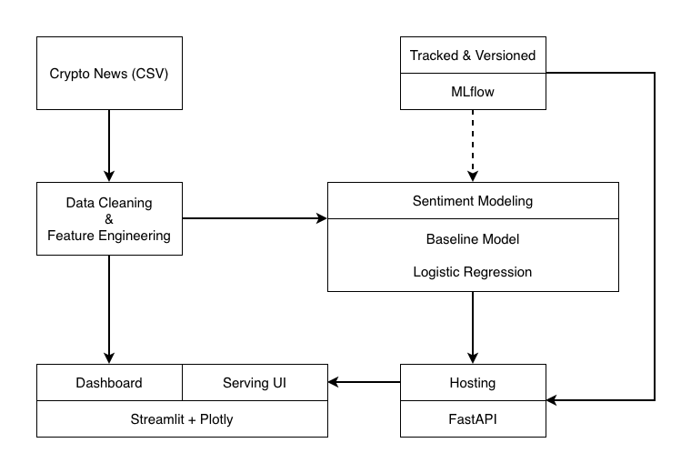

# Text_Sentiment_Classification

End-to-end sentiment classification pipeline for crypto news, covering data ingestion, preprocessing, modelling (Traditional ML & Open-source LLM), MLOps with MLflow, local model serving, and interactive dashboards.

This project is designed as a technical case study and focuses on engineering rigour, reproducibility, and model lifecycle management, rather than maximising raw model performance.

## 1. Overview

The goal of this project is to build a modular, extensible, and reproducible sentiment analysis system for crypto-related news articles, classifying text into:

- negative
- neutral
- positive

Key objectives:

- Implement two modelling approaches:
    - Traditional ML (TF-IDF + Logistic Regression)
    - Open-source LLM (Hugging Face sentiment pipeline)
- Track experiments and manage model lifecycle using MLflow
- Serve models locally via FastAPI
- Provide interactive dashboards and serving UI using Streamlit
- Enable end-to-end execution through a unified pipeline

## 2. Project Structure

```bash
.
├── assets/                         # Static assets (images, icons, etc.)
├── datasets/                       # Raw / processed datasets
├── mlartifacts/                    # MLflow artifacts
├── mlruns/                         # MLflow experiment runs
├── pages/                          # Streamlit multi-page apps
│   ├── 1_📊_Dashboard.py           # Dashboard page
│   ├── 2_🌐_Serving_UI.py          # Model serving UI page
│   └── 3_🧪_Model_Monitor.py       # Model monitoring page
├── .env                            # Environment variables
├── .env.example                    # Environment variable template
├── .gitignore                      # Git ignore rules
├── Home.py                         # Streamlit home page (entry point)
├── main.py                         # Main orchestration script
├── data.py                         # Data loading and preprocessing
├── ml_model.py                     # Machine learning model logic
├── llm_model.py                    # LLM-related logic
├── mlops.py                        # MLOps pipeline utilities
├── hosting.py                      # Model hosting / serving
├── mlflow.db                       # MLflow backend database (SQLite)
├── prototype.ipynb                 # Experimental notebook
├── README.md                       # Project documentation
└── requirements.txt                # Python dependencies
```

## 3. System Architecture

The system follows a clear, production-inspired architecture:

<p align="center">
    
</p>

## 4. Data

- Source: Kaggle – `Crypto News +` dataset
- Key fields used:
    - title, text → combined into input_text
    - date
    - source (source of news)
    - subject (used as a proxy for cryptocurrency)
    - sentiment (parsed into class, polarity, subjectivity)

### 4.1 Data Preparation Highlights

- Invalid or incomplete records are removed
- Sentiment labels are restricted to {negative, neutral, positive}
- Stratified train/test split to preserve class distribution
- Text features are constructed in a reproducible manner

### 4.2 Class Imbalance Handling

The sentiment labels in the dataset are moderately imbalanced, with positive samples being the majority class and negative samples underrepresented.

#### Class Distribution

| Class    | Count | Ratio    |
|----------|-------|----------|
| positive | 13964 | 0.449944 |
| neutral  | 10554 | 0.340068 |
| negative | 6517  | 0.209989 |

This imbalance is typical for real-world news sentiment data and requires explicit handling to avoid biased models that over-predict the majority class.

#### Strategies

To address class imbalance in a principled and production-friendly manner, the following techniques were applied:

1. Stratified Train/Test Split

```python
X_train, X_test, y_train, y_test = train_test_split(
    X, y,
    test_size=test_size,
    random_state=random_state,
    stratify=y
)
```

- Ensures that class proportions are preserved across training and test sets
- Prevents distribution shift during evaluation
- Provides a fair and reliable estimate of generalization performance

2. Class-Weighted Logistic Regression

```python
LogisticRegression(
    class_weight="balanced",
    random_state=random_state
)
```

- Automatically adjusts class weights inversely proportional to class frequencies
- Penalizes misclassification of minority classes more heavily
- Avoids the need for explicit over-sampling or synthetic data generation
- Well-suited for linear models and sparse TF-IDF feature spaces

3. Macro-Averaged Evaluation Metric

```python
f1_score(y_test, y_pred, average="macro")
```

- Treats each class equally, regardless of frequency
- Prevents dominant classes from masking poor minority-class performance
- More appropriate than accuracy or weighted F1 for imbalanced multi-class settings

#### Rationale

The chosen approach prioritises:

- Evaluation fairness (macro-averaged metrics)
- Minimal complexity (no resampling pipelines)
- Production robustness (class weights instead of data duplication)
- Reproducibility (fully deterministic splits and training)

## 5. Modelling Approaches

### 5.1 Traditional Machine Learning

#### Pipeline:

- TfidfVectorizer
- LogisticRegression(class_weight="balanced")

#### Key Characteristics:

- Handles class imbalance explicitly via class_weight
- Hyperparameter tuning using GridSearchCV
- Evaluation with f1_macro to reflect multi-class balance
- Lightweight, fast to train, and highly interpretable

#### Strengths:

- Low computational cost
- Fast iteration and training
- Easy to deploy and monitor

#### Limitations:

- Relies on surface-level lexical features
- Limited semantic understanding

### 5.2 Open-Source LLM (Hugging Face)

#### Approach:

- Uses a pre-trained sentiment classification model from Hugging Face
- No fine-tuning; inference-only evaluation

#### Key Characteristics:

- Semantic understanding beyond bag-of-words
- Batch inference supported
- GPU acceleration when available

#### Strengths:

- Strong zero-shot performance
- Minimal feature engineering
- Easy extensibility to new domains

#### Limitations:

- Higher inference latency
- Larger computational footprint
- Less transparent decision logic

### 5.3 Comparative Perspective

| Aspect                 | Traditional ML | LLM                |
|------------------------|----------------|--------------------|
| Setup Speed            | Fast           | Fast               |
| Training Cost          | Low            | None               |
| Inference Cost         | Very Low       | Medium–High        |
| Interpretability       | High           | Low                |
| Semantic Understanding | Limited        | Strong             |
| Scalability            | Excellent      | Resource-dependent |

## 6. MLOps & Model Lifecycle

- MLflow Tracking:
    - Parameters, metrics, and artifacts logged for every run

- Model Registry:
    - Best-performing model versions registered
    - Automatic promotion to @production alias based on evaluation metrics

- Artifacts:
    - Classification reports
    - Model binaries

- Local backend:
    - SQLite-based tracking store
    - File-based artifact storage

This setup enables reproducible experiments, versioned models, and clean promotion logic.

## 7. Pipeline Orchestration

The end-to-end workflow is orchestrated through a single entry point: `main.py`.

This file acts as the pipeline controller, coordinating data preparation, model training or inference, evaluation, and model registration.

### 7.1 Execution Modes

The pipeline supports two mutually exclusive execution modes, selectable via command-line arguments:

- Traditional ML pipeline (`-ml`)
- LLM-based pipeline (`-llm`)

### 7.2 Execution Flow

`main.py` performs the following steps:

1. Parse the runtime configuration and execution mode
2. Prepare and split data
3. Execute the selected modelling workflow
4. Track experiments and register models via MLflow

### 7.3 Step-by-Step Pipeline Breakdown

#### Step 1: Runtime Configuration

- Command-line arguments control:
    - Execution mode (`-ml` or `-llm`)
    - Experiment name
    - Run name prefix
    - Registered model name
    - Random seed
    - LLM model identifier (for LLM mode)
- Environment variables (e.g. `MLFLOW_TRACKING_URI`) are loaded at runtime

#### Step 2: Data Preparation

```python
X_train, X_test, y_train, y_test = data_preparation(...)
```

- Downloads and cleans raw data
- Constructs model input text
- Performs stratified train/test split
- Preserves metadata required for downstream analysis and dashboards

This step is shared across both modelling approaches to ensure consistent evaluation.

#### Step 3a: Traditional ML Workflow

```python
ml_workflow(
    classifier=logistic_regression,
    param_grid=PARAM_GRID,
    ...
)
```

The traditional ML workflow includes:

- TF-IDF feature extraction
- Logistic Regression with class weighting
- Hyperparameter tuning via GridSearchCV
- Macro-averaged evaluation on the test set
- MLflow logging of:
    - Parameters
    - Metrics
    - Classification reports
    - Trained model artifact

The best-performing model is automatically registered in MLflow.

#### Step 3b: LLM Workflow

```python
llm_workflow(
    classifier=llm_model,
    ...
)
```

The LLM workflow follows a different execution path:

- No training phase
- Batch inference on the test set
- Metric computation for comparison
- MLflow logging of:
    - Evaluation metrics
    - Classification report
    - LLM inference artifact

This workflow allows direct comparison between classical ML and LLM-based approaches under the same evaluation framework.

#### Step 4: Model Registration & Promotion

After evaluation:

- Each workflow registers the best model under a configurable name
- If a model outperforms the current production version, it is promoted to the `@production` alias
- Promotion logic is fully automated and metric-driven

## 8. Model Serving (FastAPI)

Models registered under the `production` alias are served locally using FastAPI.

### Available Endpoints

- `GET /health` – Service health check
- `GET /status` – Active model version and metadata
- `POST /predict_ml` – Predictions using traditional ML model
- `POST /predict_llm` – Predictions using LLM model

Interactive API documentation is available at:

```bash
http://localhost:8000/docs
```

## 9. Visualisation & Monitoring (Streamlit)

The Streamlit application is structured into multiple pages:

### 📊 Dashboard

- Sentiment trends over time (daily / weekly / monthly / yearly)
- Sentiment distribution by source
- Sentiment distribution by subject (used as cryptocurrency/topic)

### 🌐 Serving UI

- Call FastAPI endpoints directly from UI
- Single and batch inference
- Latency measurements
- Model version visibility

### 🧪 Model Monitor

- ML vs LLM prediction comparison
- Match rate analysis
- Latency indicators
- Active production model metadata

## 10. Environment Configuration

### Python Environment

The project is designed to run inside a Python 3.12 virtual environment.

### Dependency Management

All dependencies are pinned to specific versions to ensure reproducibility across environments.

Dependencies are defined in `requirements.txt`, covering:

- Machine learning and NLP:

    - `scikit-learn`
    - `transformers`
    - `torch`

- MLOps:

    - `mlflow`

- Serving and visualisation:

    - `fastapi`
    - `uvicorn`
    - `streamlit`
    - `plotly`

- Data access and utilities:

    - `pandas`
    - `numpy`
    - `requests`
    - `kagglehub`

### Environment Variables

Runtime configuration is managed via environment variables loaded from a `.env` file:

- `MLFLOW_TRACKING_URI`
- `FASTAPI_URI`
- `KAGGLE_USERNAME`
- `KAGGLE_KEY`
- Cache-related variables for Hugging Face and Kaggle

Sensitive credentials are excluded from version control and expected to be provided locally.

## 11. Run the Project Locally

### 11.1 Activate Virtual Environment

```bash
source .venv/bin/activate
```

### 11.2 Start MLflow Tracking Server

```bash
mlflow server --default-artifact-root ./mlartifacts --backend-store-uri sqlite:///mlflow.db
```

MLflow UI:

```bash
http://127.0.0.1:5000
```

### 11.3 Start FastAPI Service

```bash
uvicorn hosting:app --reload
```

OR

```bash
uvicorn hosting:app --host 127.0.0.1 --port 8000 --reload
```

FastAPI Docs:

```bash
http://localhost:8000/docs
```

### 11.4 Launch Streamlit Application

```bash
streamlit run Home.py
```

Use the sidebar to navigate between Dashboard, Serving UI, and Model Monitor pages.

### 11.5 Run Training / Evaluation Pipeline

#### Traditional ML

```bash
python main.py -ml \
    --experiment_name tfidf_lr_experiment \
    --run_name_prefix tfidf_lr_run \
    --registered_model_name TFIDF_Logistic_Regression
```

#### LLM Evaluation

```bash
python main.py -llm \
    --llm_model cardiffnlp/twitter-roberta-base-sentiment-latest \
    --experiment_name llm_experiment \
    --run_name_prefix llm_run \
    --registered_model_name HF_Cardiffnlp_RoBERTa_Sentiment
```

## 12. Design Decisions & Assumptions

- `subject` is treated as a proxy for cryptocurrency
- LLM approach is inference-only for comparison purposes
- Class imbalance is explicitly handled in traditional ML
- The system prioritizes clarity, reproducibility, and lifecycle management over maximal accuracy

## 13. Future Improvements

### 13.1 Current State

At the current stage, the project focuses on:

- Functional correctness
- End-to-end integration
- Manual validation through dashboards and serving UI

Formal automated testing has not yet been implemented.

### 13.2 Future

- Introduce automated tests to improve reliability and maintainability
- Fine-tuning LLMs for domain-specific sentiment
- Online monitoring and drift detection
- Automated retraining workflows
- Deployment to cloud-native environments
- More granular cryptocurrency normalisation

## 14. Summary

This project demonstrates how a sentiment classification pipeline can be built with **production-oriented engineering practices**, combining:

- Multiple modelling paradigms
- Robust MLOps
- Local serving infrastructure
- Interactive visualisation and monitoring

It is designed to be clear, extensible, and technically reviewable, making trade-offs explicit and reproducible.

